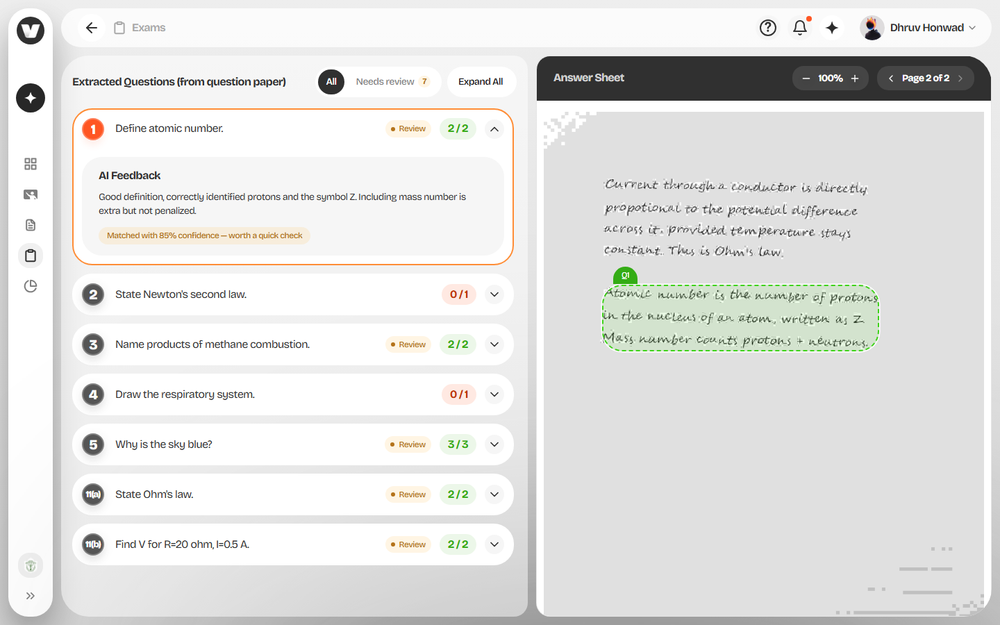
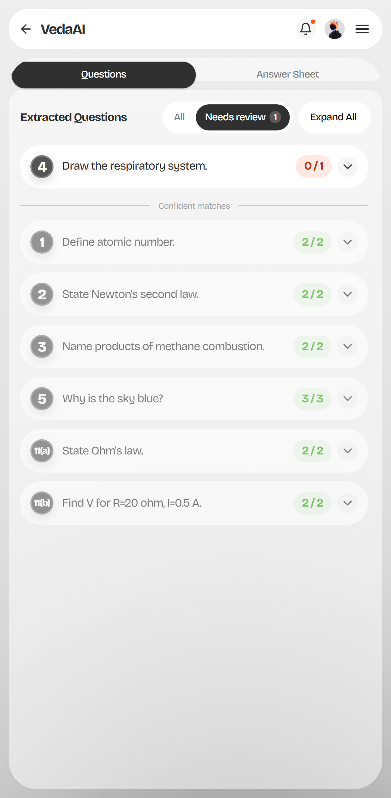

# VedaAI — AI Teacher's Toolkit
A teacher uploads a question paper and a student's handwritten answer sheet. The app
reads both, works out which answer goes with which question, highlights that answer on
the scan, and grades it with written feedback.

Built with Next.js 16 (App Router), TypeScript, Tailwind v4 and shadcn/ui.



## What it does

1. **Upload** — question paper and answer sheet, PDF or image, 10MB each.
2. **Extract** — questions come out with their printed numbering intact, including
   sub-parts like `11(a)` / `11(b)`. Handwriting is transcribed into separate answer
   blocks, each with a bounding box saying where it sits on the page.
3. **Map** — each answer block is matched to a question by meaning rather than by
   position, with a confidence score. Questions nobody answered are marked
   `unanswered`; writing that doesn't belong to any question is `unmatched`.
4. **Grade** — every matched answer gets a score out of a maximum the model infers from
   the question, plus feedback.

## Screens

| Screen | What it does |
| --- | --- |
| **Upload — empty** | Two dropzones (Question Paper, Answer Sheet). PDF or image, max 10MB. "Start Mapping" stays disabled until both are there. |
| **Upload — filled** | Each dropzone shows filename, size and page count, with a remove button. |
| **Loading** | Sparkle animation and "Extracting…" while the pipeline runs. |
| **Mapping** | Left: the extracted questions, each one collapsible with a score badge and AI feedback. Right: the answer sheet with zoom, page navigation, and a coloured box drawn over whichever answer is selected. On phones these become two tabs instead of a split view. |

The two panels scroll independently inside a fixed viewport, so the page itself never
scrolls.

## Architecture

Four steps, split across two providers by default:

| Step | Provider | Model |
| --- | --- | --- |
| Extract questions | Google Gemini | `gemini-3.5-flash-lite` |
| Extract answers | Google Gemini | `gemini-3.5-flash-lite` |
| Map answers → questions | Groq | `openai/gpt-oss-120b` |
| Grade all answers | Groq | `openai/gpt-oss-120b` |

Claude Sonnet 5 (`claude-sonnet-5`) is available as an optional, explicitly opt-in
enhancement for better feedback quality, enabled with `ENABLE_CLAUDE_GRADING=true` and
the operator's own paid Anthropic credits. It is **not** part of the default
configuration: the brief asks for models with a free tier and Anthropic has no ongoing
one, so grading ships on Groq. With the flag on, Claude is tried first and falls back to
Groq automatically on any failure.

The split follows from free-tier quota. Gemini is the only provider here that can read an
image, and it also has the tighter limit — reading a printed paper and transcribing
handwriting both need vision, and answer extraction has to return bounding boxes grounded
in the page image. Mapping and grading never touch the image at all: by the time they run,
the handwriting is already text. So those two steps go elsewhere, and the scarce vision
quota stays with the two that genuinely need it.

Grading is one batched call for the whole paper rather than one call per question. That
was the single biggest saving against the free tier — a 30-question paper costs the same
one call as a 3-question paper. It holds whichever provider marks the paper, because
batching is a property of the prompt rather than the provider.

By default every text step runs on Groq, which keeps the whole app inside free tiers. If
Claude grading is switched on, it is tried first — it writes noticeably better feedback for
a student to read — and falls back to Groq automatically on *any* failure: rate limit,
timeout, outage, malformed output, exhausted credit. That fallback matters because of how
this is hosted; on free and trial tiers, a grading step that stops working the moment a
quota runs out is no use to a teacher. The server log records which provider served each
call.

That works out to **4 API calls in the happy path**, no matter how long the paper is:
2 Gemini (the extractions run concurrently), 1 Groq for mapping, and 1 for grading. In the
unhappy path the count varies, and with Claude enabled so does the provider mix.

It is worth being precise here, because "fixed at 4" would not be true. Every step retries
on a transient failure, and a retry is another call. Groq rejects its own JSON often enough
on code-heavy scripts (roughly a third of calls on one 14-block script) that mapping
retries up to twice before giving up; the extractions retry once. So 4 is the number to
expect and the number a healthy session uses, but a session that hits provider problems can
spend up to 12 — and none of those retried calls return anything usable. The guarantee that
genuinely is fixed is the batching one: one grading call per paper, never one per question.

```
 upload ──► /api/extract-questions ─┐
                                    ├─► /api/map-answers ──► /api/grade ──► mapping screen
 upload ──► /api/extract-answers  ──┘
```

All four routes run on the Node runtime. PDF pages are rasterised at 2x with `pdfjs-dist`
and `@napi-rs/canvas` before going to the vision model.

Those four routes are rate limited in `proxy.ts` to 10 requests per IP per 10 minutes —
a normal session uses 4, so this leaves room to try the flow a couple of times while
stopping a bot from burning the free-tier quota the whole app depends on. It is an
in-memory counter per server instance, sized for a public demo rather than production.

### Where things live

```
app/api/                four route handlers, one per pipeline step
lib/vision.ts           Gemini: question + answer extraction, bbox normalisation
lib/reasoning.ts        Groq: mapping, and the shared model-fallback chain
lib/grading.ts          grading: Groq by default, Claude first when opted in
lib/answer-blocks.ts    splits a block that has swallowed two answers
lib/mapping-repair.ts   guarantees every question and block appears exactly once
lib/pdf-to-images.ts    PDF → 2x page images
lib/llm-json.ts         defensive JSON parsing shared by all three providers
lib/api.ts              the only module that knows where data comes from
lib/types.ts            the backend contract (Question, AnswerBlock, Mapping, GradeResult)
hooks/use-toolkit.ts    flow state; joins questions ↔ mappings ↔ grades
components/veda/        the screens
```

`lib/api.ts` is the one seam between the UI and the data. Components and hooks only ever
call `runExtractionPipeline()`, so switching between mock and live data doesn't touch
anything else.

## Setup

Needs **Node 22.13+** — that floor comes from `pdfjs-dist` (Next itself only needs 20.9+).
`@napi-rs/canvas` is a native binding, so install it on whatever machine runs the server
rather than copying `node_modules` between platforms.

```bash
npm install
cp .env.local.example .env.local   # then fill in the keys
npm run dev                        # http://localhost:3000
```

| Variable | Required | Purpose |
| --- | --- | --- |
| `GEMINI_API_KEY` | yes (unless mocking) | Question and answer extraction. Free key: <https://aistudio.google.com/apikey> |
| `GROQ_API_KEY` | yes (unless mocking) | Mapping and grading. Free key: <https://console.groq.com/keys> |
| `ENABLE_CLAUDE_GRADING` | no (default `false`) | Opt-in — requires your own paid Anthropic API key, since Claude has no ongoing free tier. The app is fully free-tier-compliant without it. |
| `ANTHROPIC_API_KEY` | only if the flag above is `true` | Claude grading. Setting this alone does nothing; the flag is what switches Claude on. Key: <https://console.anthropic.com/settings/keys> |
| `NEXT_PUBLIC_USE_MOCK_DATA` | no | `true` runs the whole flow off `lib/mock-data.ts` — no keys, no network. Anything else uses the real routes. |

The free tiers cover normal use comfortably at around 4 calls a session. Groq's is the one
that can realistically be exhausted: its daily token cap is low enough that a long testing
session will reach it. Restart the dev server after changing env vars.

### If you'd rather not set up keys

Set `NEXT_PUBLIC_USE_MOCK_DATA=true` and you can click through all four screens against a
fixture with 12 questions (including `11(a)` / `11(b)`), one unanswered question, one
unmatched stray block, and one answer that spans a page break. It is the quickest way to
see the UI.

## Confidence and the "Needs review" toggle

This is worth explaining, because the UI doesn't show the reasoning behind it.

Every mapping comes back with a `confidence` from the model. Below
`LOW_CONFIDENCE_THRESHOLD` (currently **0.90**, in `components/veda/bbox-overlay.tsx`) the
question row gets a muted amber **Review** tag next to its score, and the box on the scan
is drawn dashed instead of solid — same colour, just less certain.

The 0.90 is measured rather than chosen by feel. In practice `openai/gpt-oss-120b` uses
only a narrow band: about **0.95–0.99** when the answer literally has the question number
written on it ("Ans 7:"), and **0.80–0.88** when it had to infer the match from the
content. It almost never drops below 0.8, even on fragments I made deliberately ambiguous
to push it lower. My first choice of 0.6 would therefore never have triggered at all. 0.90
is the line that actually separates "the student numbered this" from "the model worked
this out", and the second group is the one a teacher should glance at.

The **Needs review** toggle reorders the list rather than filtering it: unanswered
questions first, then unmatched stray writing, then the low-confidence matches, with the
confident ones still below and dimmed. Nothing disappears.



## Testing

I tested this against synthetic scanned papers — out-of-order answers, answers spanning a
page break, unanswered questions, stray unmatched writing, mobile layout, and whether the
confidence score meant anything. Five real bugs came out of it, all of which passed `tsc`,
`eslint` and `next build` cleanly, and two of which existed only on the deployed site, so
finding them meant testing against the live URL. The worst of them returned HTTP 200 with
an empty result instead of failing.

The grading fallback is tested on both sides rather than only the happy one: the Claude
path and the Groq path were each made to run for real, with the failure injected using a
bad key and a dead endpoint. The happy path is confirmed on the deployed site as well as
locally.

Two things are open rather than finished, and the notes say so directly. A real answer can
still be attributed to the wrong question roughly once in every ten to fourteen runs, when
the vision model merges two answers *and* omits the label the code would use to split them
apart. And the retry that stops `/api/map-answers` returning 500s is unit-tested, but its
live measurement is incomplete, because I exhausted Groq's daily token budget during the
verification.

Notes are in **[docs/testing-notes.md](docs/testing-notes.md)**.
