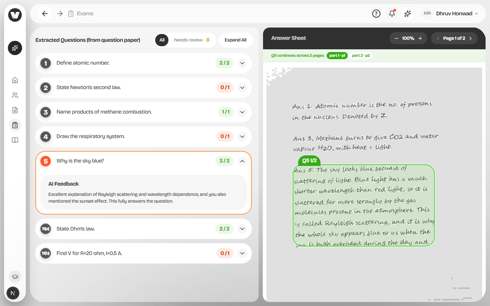

# Testing & verification notes

Engineering notes on how this was verified, what was deliberately tested, and what
broke along the way.

The test scripts themselves are **not committed** — they drive a real browser and
spend real API quota, so they need keys a reviewer will not have. What follows is
the record of what they did and what they found.

## Why synthetic fixtures

No real student papers were available while building this, and the input that
matters most — a phone photo of handwriting — is also the input most likely to
break things. Typed, vector-only PDFs are a poor proxy: they exercise a completely
different code path inside `pdfjs` (see the first bug below), so testing against
them gives false confidence.

So the fixtures are generated: each page is rendered to a canvas, then embedded
into a PDF as a **full-page JPEG**, which is structurally what a scan actually is.

Each fixture simulates:

| Property | How |
| --- | --- |
| Handwriting | A script/handwriting font rather than a typeface |
| Per-character jitter | Every glyph individually offset, rotated ±0.03 rad, and size-varied |
| Baseline drift | Each line randomly displaced so rows are not perfectly level |
| Page skew | The whole page rotated 1.1–1.4°, as if photographed at an angle |
| Ruled paper | Blue rules and a red margin, drawn under the writing |
| Uneven lighting | A diagonal gradient plus vignette, imitating a shadow across the page |
| Sensor noise | Per-pixel grain across all three channels |
| Compression | Encoded as JPEG at quality 0.72, so real DCT artefacts are present |

Deliberate spelling errors ("becuase", "propotional") are baked into the text to
check the transcription reproduces what is written rather than silently correcting
it. It does.

Four variants were used:

- **labelled** — answers prefixed `Ans 1:`, `Ans 3:` …
- **unlabelled** — same answers, no numbering, so mapping must work from meaning
- **spanning** — one answer overflowing the foot of page 1 and resuming mid-sentence
  on page 2 with no new label
- **shuffled** — answers physically ordered `3, 11(b), 5, 11(a), 1`, unlabelled, so
  position is actively misleading

## Edge cases tested

### Out-of-order answers

The shuffled fixture. Correctness was graded against the **content** of each mapped
block — a required pattern plus a must-not-match pattern — so "an order that happens
to line up" cannot pass.

| Question | Mapped block | Position on sheet | Result |
| --- | --- | --- | --- |
| Q1 | `block-5` | 5th (last) | pass |
| Q3 | `block-1` | 1st | pass |
| Q5 | `block-3` | 3rd | pass |
| Q11(a) | `block-4` | 4th | pass |
| Q11(b) | `block-2` | 2nd | pass |

**5 pass, 0 fail.** Q2 and Q4 correctly `unanswered`.

The `11(a)` / `11(b)` pair is the interesting case: both answers are about Ohm's
law, so topic alone cannot separate them. The law statement went to `11(a)` and the
numeric substitution (`V = 20 × 0.5 = 10 volts`) to `11(b)`, correctly.

The question list renders in **printed order** (`1, 2, 3, 4, 5, 11(a), 11(b)`), not
answer-sheet order, and selecting a question navigates the viewer to whichever page
its answer actually sits on — verified from both ends, with Q1 (physically last,
page 2) and Q3 (physically first, page 1).

### Multi-page answer spanning

The spanning fixture. Extraction produced:

```
ans-5       page 1  continuesFromPrevious: false
ans-5-cont  page 2  continuesFromPrevious: true

mapping  Q5  matched  blocks: ["ans-5", "ans-5-cont"]
```

The flag is set correctly and both blocks map to one question.

The **UI initially failed this case.** The viewer shows one page at a time and
filtered regions to the current page, so selecting Q5 highlighted only the first
half with no indication a second half existed — the answer appeared to stop
mid-sentence. Fixed by deriving every page the selected answer occupies and
surfacing them: region labels became `Q5 1/2` / `Q5 2/2`, and a strip under the
viewer header links to each part.



### Unanswered questions and unmatched writing

Both are first-class states, not error cases:

- A question with no answer on the sheet maps as `unanswered`, is scored 0, and
  gets feedback saying no answer was found rather than a critique of nothing.
- Stray writing (rough work, "check units V") maps as `unmatched` with
  `questionId: null`, renders as a dashed orange card in the triage view, and
  clicking it jumps the viewer to that page.
- A defensive pass in `/api/map-answers` adds any question the model omitted back
  as `unanswered`, so a question can never silently vanish from the list.

### Mobile viewport

Driven at Pixel 7 (412×915). Both tab states render correctly, Review tags and
triage ordering hold, and the "Review" word collapses to just its amber dot at
phone width while the tag itself remains.

Overlay positioning was checked numerically rather than by eye — the rendered box
was compared against the bbox the API returned in the same run:

```
api bbox: [116, 117, 225, 664]
expected: {fracTop: 0.116, fracLeft: 0.117, fracH: 0.109, fracW: 0.547}
measured: {fracTop: 0.116, fracLeft: 0.117, fracH: 0.109, fracW: 0.547}
max deviation: 0.0000
```

One cosmetic fix came out of this: the region label was a fixed 16px pill, which at
phone width swamped a ~50px-tall box and covered the first line of the answer. It
now scales down below `lg`.

### Confidence calibration

Initially **broken, and quietly so.** Every mapping returned `0.99`, including on a
deliberately messy scan. Stripping the `Ans N:` prefixes to force meaning-based
matching still returned 0.98–0.99 — and in that run a rough-work block was wrongly
absorbed into `11(b)` while confidence moved only 0.99 → 0.98. The number was not
tracking uncertainty at all.

Replacing "use the full range" in the prompt with an **anchored rubric** (explicit
bands, criteria per band, and an instruction not to default to 0.99) fixed it:

| Input | Before | After |
| --- | --- | --- |
| Labelled (`Ans 1:`) | 0.99 | 0.96–0.97 |
| Unlabelled | 0.98–0.99 | 0.80–0.88 |
| Deliberately ambiguous fragments | — | 0.85 |

The observed floor is ~0.8 even on genuinely ambiguous input, which is why
`LOW_CONFIDENCE_THRESHOLD` is 0.90 rather than a more intuitive 0.6 — see the
README section on this.

### Bounding box quality

Across runs, `normalizeBbox` reported every box arriving clean: no inverted
min/max, no out-of-range clamping, no whole-page boxes. The raw coordinates are
accurate — on one fixture `xmin` came back as `117/1000` against a true left margin
of 62pt on a 612pt page, i.e. correct to the rounding.

The normalisation is still kept, because Gemini did initially return `bbox` **nested
one level** (`[[ymin, xmin, ymax, xmax]]`), which failed a strict length-4 check and
sent every box to the fallback. Tightening the prompt with an explicit
correct/incorrect example fixed the output; the unwrapping code remains as a net.

## Two real bugs found

Both passed `tsc --noEmit`, `eslint` and `next build` cleanly. Neither was
detectable without executing the real thing.

### 1. `@napi-rs/canvas` vs `node-canvas`

**Symptom.** `/api/extract-questions` and `/api/extract-answers` both returned 500
with `TypeError: Image or Canvas expected`, thrown inside pdf.js at
`paintInlineImageXObject` → `ctx.drawImage(...)`.

**Why it hid.** It only fires on a PDF page that contains an embedded raster image.
The early fixtures were vector text only, so `paintImageXObject` never ran. Every
scanned page hits it immediately.

**Root cause.** Not a missing canvas factory — pdf.js v6 already selects a
`NodeCanvasFactory` automatically in Node. That factory is written against
`@napi-rs/canvas`:

```js
class NodeCanvasFactory extends BaseCanvasFactory {
  _createCanvas(width, height) {
    const canvas = require("@napi-rs/canvas");   // not node-canvas
```

The project had `canvas` (node-canvas) installed instead. Mixing the two means
pdf.js hands a foreign object to a node-canvas 2D context, which rejects anything
that is not its own `Image`/`Canvas`.

**Fix.** Swapped to `@napi-rs/canvas` and removed `canvas`. An explicit
`CanvasFactory` is also passed to `getDocument()` — not required for the fix, but it
makes the dependency explicit rather than relying on pdf.js resolving it internally
through the bundler. Note the option is `CanvasFactory` with a capital C in v6, and
it takes the class, not an instance.

A related earlier fix: `pdfjs-dist` and `@napi-rs/canvas` are both listed in
`serverExternalPackages` in `next.config.ts`. Bundling pdf.js rewrites the runtime
relative import of its fake worker and it fails to load.

### 2. Panels stacked instead of side by side

**Symptom.** At 1440px the mapping screen rendered the question list and the answer
sheet vertically stacked, not as the two-column split the design calls for.

**Why it hid.** Pure CSS cascade. Nothing in TypeScript or the build can see it —
it only appears in a real browser render, which is how it was caught.

**Root cause.** shadcn's `Tabs` root ships `data-horizontal:flex-col`, compiling to:

```css
.data-horizontal\:flex-col[data-orientation="horizontal"] { flex-direction: column }
```

That selector scores **0,2,0** (class + attribute). The override was `lg:flex-row`,
which scores **0,1,0** — media queries contribute no specificity. The column rule
therefore won at every width.

**Fix.** `lg:flex-row!`, matching the `lg:flex!` already used on the panels to
override Radix's `hidden` on the inactive tab. The comment in
`components/veda/mapping-screen.tsx` explains why, because the `!` looks removable
and is not.

## What is not covered

- No real student handwriting has been through the pipeline. Synthetic fixtures
  approximate the failure modes of a scan but are not a substitute for the real
  distribution of handwriting quality.
- Confidence calibration is characterised for `openai/gpt-oss-120b` specifically.
  A different model would need the threshold re-measured.
- No automated test suite is committed. Verification was script-driven against a
  live pipeline; making it CI-ready would mean recording provider responses so the
  tests can run without keys.
